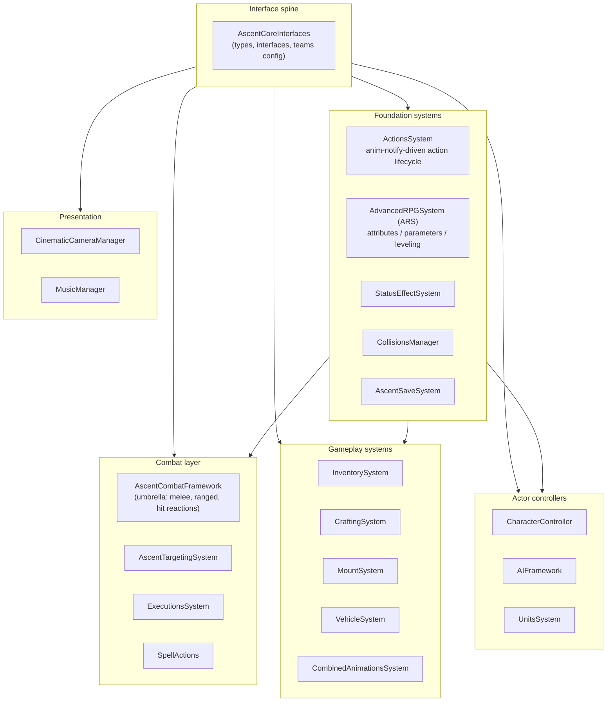

# Ascent Combat Framework — Integration Plan

> Architecture analysis and integration plan for evaluating [Pask / Dark Tower Interactive's *Ascent Combat Framework* (ACF)](https://www.unrealengine.com/marketplace/en-US/product/19f41df17ac5412c96ac38cbaeb43810) as the combat foundation for an action RPG project on UE 5.7. 21 runtime modules, 462 C++ files mapped, port surface scoped.

**Status:** evaluation + integration plan complete. Custom extension modules scoped (not yet implemented in this repo).

**Browse:** → [`media/`](./media/) — demo GIFs and screenshots (drop zone).

---

## What ACF is, and why look at it

ACF is a commercial UE5 plugin that ships a complete action-RPG runtime as 21 self-contained modules — combat, actions, AI, RPG stats, inventory, crafting, mounts, executions, targeting, save/load, status effects, vehicles. Each system is built behind an interface and exposed via components, so you can pull in the three or four you need and ignore the rest.

The interesting thing — and the reason it's worth evaluating instead of dismissing as "another marketplace pack" — is the **architectural discipline**. The whole framework is built on one pattern: a thin shared-interface module (`AscentCoreInterfaces`) that every other module depends on, with no cross-module direct dependencies elsewhere. That means modules are independently swappable, the dependency graph is a tree (not a soup), and a typical project can disable two-thirds of them without breaking the rest.

This is roughly the architecture I'd build if I were writing an action RPG framework from scratch. Saves a few months.

## Architecture

Every arrow is "depends on." The graph has no cycles — the spine module owns all shared types and interfaces, so any system can be removed without breaking unrelated systems. This is the key property worth modeling after, even if I weren't using ACF directly.

## Engineering writeup

### Why ACF over rolling custom combat on stock GAS

Three considered alternatives before picking ACF:

1. **Custom combat on UE's GameplayAbilitySystem (GAS).** GAS is the industry-standard, but it solves a different problem — it's a *network-replicated ability execution engine*, not a combat framework. Building Soulslike combat on top of GAS means writing the entire combo system, hit reaction graph, lock-on, executions, and AI perception layer yourself. Roughly 6–9 months of senior-engineer time to get parity with what ACF ships day one.

2. **Other action RPG marketplace plugins** (Combat System Pro, Combat Plus, etc.). Most are blueprint-only or have a single monolithic module. ACF is the only one in this category with a clean multi-module C++ architecture, which matters because we want to extend it, not just configure it.

3. **Roll completely custom.** Tempting, but the ROI is bad. The combat framework problem is well-trodden and ACF's solutions are reasonable. Custom work is better spent on what makes the project unique (the world, the enemies, the specific combat feel) — not re-deriving how to bind an animation notify to an action.

ACF wins on the cost-of-extension axis. Custom modules slot in cleanly because the spine is interface-only.

### The anim-notify-driven action lifecycle

The core trick that makes ACF feel like *Dark Souls* and not like a generic combat plugin: combat actions are **animation-driven**, not logic-driven.

A typical attack works like this:

1. Input fires an `ACFAttackAction` (subclass of `ACFBaseAction`).
2. The action starts playing a montage.
3. Animation notifies (`ACFNotifyAction`, `ACFNotifyExitAction`) fire at frame-accurate points to open the hit window, enable collision, switch to the recovery state, and allow combo input buffering.
4. `CollisionsManager` listens for the open-hit-window notify and starts tracing weapon collision.
5. Action ends when the exit notify fires or the montage completes.

This is *the* pattern for action RPG combat — Soulslike, Monster Hunter, Devil May Cry all work this way. ACF's contribution is wrapping it in `ACFActionsSet` data assets so designers can author entire move sets in the editor without touching code.

For an extension module, this is the cleanest seam: write a new `ACFBaseAction` subclass, build the montage, drop it into an action set, done.

### Module subset scoped for the project

Of the 21 modules ACF ships, this project needs roughly half. Locked in:

- `AscentCoreInterfaces` — required spine.
- `ActionsSystem` — required for any custom action.
- `AscentCombatFramework` — main melee/ranged.
- `AdvancedRPGSystem` — stats, attributes.
- `AscentTargetingSystem` — lock-on.
- `CollisionsManager` — anim-driven weapon collision.
- `AIFramework` — base AI perception + behavior tree.
- `InventorySystem` — equippable weapons.
- `StatusEffectSystem` — buffs, bleed, poison.
- `CharacterController` — player base.
- `AscentSaveSystem` — save/load.

Out of scope for v1 (kept in source tree but unloaded via per-module `Optional`/disable in `.uplugin`):

- `MountSystem`, `VehicleSystem` — no mounts in the design.
- `CraftingSystem` — no crafting loop planned.
- `MusicManager` — using Wwise for audio, not the bundled manager.
- `CinematicCameraManager` — using stock Sequencer + Camera Director instead.
- `ExecutionsSystem`, `CombinedAnimationsSystem` — possibly v2, not v1.
- `SpellActions`, `UnitsSystem` — not in scope.
- `AscentEditor` — kept for editor tooling.

### 5.5 → 5.7 port surface

ACF ships targeting UE 5.5. Project target is 5.7. Three areas to watch when porting:

**Enhanced Input / Action binding.** UE 5.6 deprecated some `EnhancedInputComponent` binding APIs in favor of the `InputAction.h` typed binding pattern. ACF's `CharacterController` wires inputs directly — likely needs adjustment in `ACFCharacter::SetupPlayerInputComponent`. Surface area is bounded but real.

**Animation API drift.** `MotionWarping` and `AnimationWarping` plugins (both required by ACF) got API tightening in 5.6 and 5.7 around component construction and trigger setup. Anim-notify-heavy code like ACF's `ActionsSystem` will warn but should still link.

**MSVC toolchain ban carryover.** Same 5.7 UBT toolchain ban (MSVC 14.44 explicitly rejected) applies. If the team's build machine only has 14.44 installed, ACF won't even start compiling. Fix is documented in the [agent kit port notes](../unreal-claude-agent-kit/) — install MSVC 14.38.33130 via VS Installer individual components.

Estimated port effort: 1–2 days of focused work to get all 11 retained modules clean-compiling on 5.7, plus a half day to verify runtime behavior (input binding, anim notify timing) in PIE.

### Custom extension modules (scoped, not yet implemented)

Two custom modules planned to live alongside the ACF source:

**`ACFExt_ProjectActions`** — project-specific `ACFBaseAction` subclasses for our unique combat moves (charged heavy attack with parry-frame, dash-cancel system, weapon-stance switching). Adds one new data-asset action set; doesn't modify any ACF source.

**`ACFExt_EnemyDirector`** — squad-level enemy coordination on top of `AIFramework`. ACF's AI is per-actor; we need group-level behavior (flanking, encirclement, retreat-to-formation). Implemented as a world subsystem that subscribes to per-AI events via the ACF AI interface.

Both modules depend only on `AscentCoreInterfaces` plus the specific systems they touch, preserving the spine-only-dependency invariant.

## Toolchain

| | |
|---|---|
| Engine | UE 5.7.0 (port target; ACF ships on 5.5) |
| Compiler | MSVC 14.38.33130 (UBT-enforced; 14.44 banned) |
| Build | UnrealBuildTool, adaptive non-unity |
| Required plugins | OnlineSubsystem, Niagara, MotionWarping, EnhancedInput, GameplayAbilities, ChaosVehicles, AnimationWarping |
| Project context | Single-player action RPG, third-person, Windows host |

---

## What's in this repository

This is a **writeup of the engineering work**, not a republish of ACF source. The Ascent Combat Framework is proprietary to Pask / Dark Tower Interactive and is not redistributed here in any form.

You'll find:
- This architecture analysis and integration plan.
- Module dependency mapping and scope decisions.
- 5.5 → 5.7 port notes.
- Scoped specs for the two planned custom extension modules.

You won't find:
- ACF source code. To evaluate or license the framework, see the [Unreal Marketplace listing](https://www.unrealengine.com/marketplace/en-US/product/19f41df17ac5412c96ac38cbaeb43810) or the [ACF wiki](https://www.wikiful.com/@ACF/ascent-combat-framework-wiki/ascent-combat-framework).
- Project assets from the action RPG itself (private repo).

---

## License

This writeup is MIT-licensed. ACF is governed by the Unreal Marketplace EULA. Linked upstream products are governed by their own licenses.

## Author

Lina Hal Hasnawi · [github.com/linahalhasnawi-boop](https://github.com/linahalhasnawi-boop)
