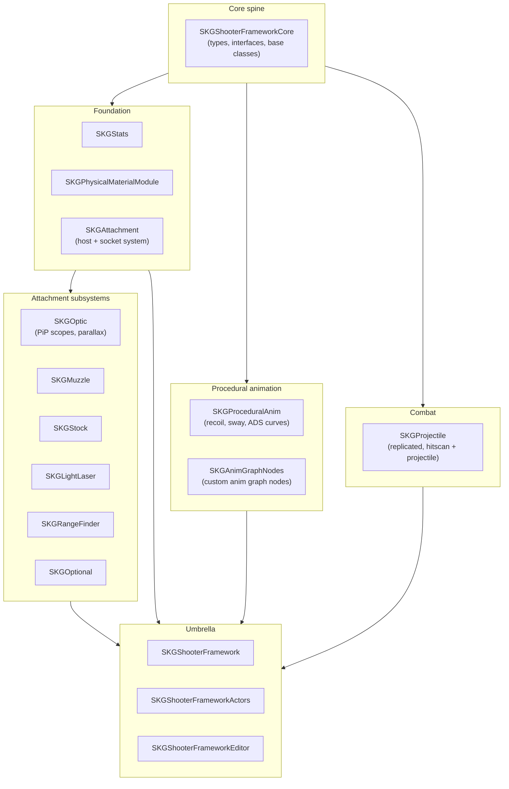

# SKG Shooter Framework — Integration Plan

> Architecture analysis and integration plan for evaluating [Sneaky Kitty Game Dev's *SKG Shooter Framework*](https://www.unrealengine.com/marketplace/en-US/product/4986d4f5b73148deb154e1cd31dd9623) (v1.3.2 on UE 5.6) as the weapon foundation for a multiplayer FPS project on UE 5.7. 16 runtime modules, 171 C++ files mapped, port surface scoped.

**Status:** evaluation + integration plan complete. Custom extension modules scoped (not yet implemented in this repo).

**Browse:** → [`media/`](./media/) — demo GIFs and screenshots (drop zone).

---

## What SKG is, and why look at it

SKG is a commercial UE5 plugin built around two ideas that most FPS frameworks get wrong:

1. **Weapon animation is procedural, not hand-keyed.** Recoil, sway, ADS interpolation, hand grip placement — all derived at runtime from data assets describing the weapon's physics (mass, grip points, ergonomics). Add a new gun and you author a data asset, not a montage library.

2. **Attachments are first-class modules, not weapon variants.** Optics, muzzles, stocks, lights, lasers, and rangefinders each live in their own module behind their own interface. A weapon is a host with sockets; runtime attachment swap is one function call. Drop the modules you don't need and the host doesn't care.

The combination matters because FPS feel scales badly with content: handcrafted weapon animation × handcrafted attachment swaps × multiplayer replication is roughly the worst combinatorial explosion in game programming. SKG solves it by making both procedural and modular at the architectural level, not as polish on top.

## Architecture



Same dependency-tree property as the other two frameworks in this portfolio: a thin Core module owns shared interfaces; nothing depends sideways. Removing `SKGRangeFinder` or `SKGOptional` doesn't ripple. The umbrella module is the only assembler.

## Engineering writeup

### Why SKG over the alternatives

Three candidates considered before picking SKG:

1. **Lyra Starter Game.** Epic's reference FPS sample. Excellent for menus, abilities, and online services — but its weapon system is shallow. No procedural animation, no real attachment system, and weapon variants are blueprint-asset copies. Lyra is a great chassis for the *non-combat* parts of an FPS; SKG is for everything you actually shoot with.

2. **Roll fully custom.** The procedural animation rig alone is a 3–4 month project for one engineer to reach SKG's quality bar — getting the curve math right for recoil + sway interpolation across weapon mass classes is non-trivial, and the *test loop* for "does this gun feel good" is slow. Optic rendering (picture-in-picture with corrected parallax) is another month. The build/buy decision skews hard toward buy when the upstream is this well-architected.

3. **Other marketplace FPS kits.** Most are blueprint-only or sell a finished demo, not a framework. They ship one gun done well and break when you add the second. SKG ships a *system* — adding the tenth gun is the same effort as adding the second.

SKG wins on the procedural axis specifically. Once integrated, content scaling is a data-asset workflow rather than an animator-bottleneck.

### The procedural animation pattern

Hand-keyed weapon animation has a hidden tax: every weapon needs its own keyed ADS pose, its own recoil montage, its own sway loop. Five weapons × three magnification optics × four stocks = sixty hand-authored animation sets. The cost scales multiplicatively, not additively.

SKG inverts this. The animation pipeline is:

1. A weapon asset declares its **physics data**: mass, balance point, grip transforms, ergonomics rating.
2. The character's anim graph contains SKG's custom nodes (`SKGAnimGraphNodes` module) — these consume the weapon's physics data and the global recoil/sway/ADS curves.
3. At runtime, the nodes generate ADS lerp, idle sway, recoil kick, and grip-corrected hand IK from the same curve library, parameterized by weapon physics.

Adding a new weapon is a data-asset edit. No new animations. No new montages. The same curves drive everything.

This is the architecturally correct move for any FPS project that ships more than ~5 weapons. Hand-keying does not scale; procedural does.

### Modular attachments by socket

Each attachment type is its own module behind an interface. The host weapon exposes typed sockets (an optic socket, a muzzle socket, etc.). Runtime swap is:

```cpp
WeaponComponent->SetAttachment(SocketType::Optic, NewOpticActor);
```

The host doesn't know what an optic *is*. It just knows the socket contract. New attachment types extend by adding a module, declaring a socket type, implementing the interface — no host-side changes.

This is the same pattern the other two frameworks in this portfolio use, but applied to a finer-grained problem. ACF uses it for combat *actions*; SKG uses it for weapon *parts*. Same architectural instinct.

### Module subset scoped for the project

Of the 17 modules SKG declares (16 unique — see the descriptor bug noted below), this project locks in:

- `SKGShooterFrameworkCore` — required spine.
- `SKGShooterFramework` + `SKGShooterFrameworkActors` — umbrella + base actors.
- `SKGAttachment` — host + socket system.
- `SKGOptic` — picture-in-picture scopes.
- `SKGMuzzle` — flash hiders, suppressors, compensators.
- `SKGStock` — stocks (recoil modifier).
- `SKGLightLaser` — flashlights, IR designators.
- `SKGProceduralAnim` + `SKGAnimGraphNodes` — required for procedural feel.
- `SKGProjectile` — replicated projectile + hitscan.
- `SKGPhysicalMaterialModule` — surface impact effects.
- `SKGStats` — weapon stats.
- `SKGShooterFrameworkEditor` — editor tooling.

Out of scope for v1:

- `SKGRangeFinder` — no rangefinders in the design.
- `SKGOptional` — optional attachments not used.

### 5.6 → 5.7 port surface

Smallest port jump in this portfolio (one minor version). Three areas to watch:

**StructUtils plugin refactor.** SKG depends on `StructUtils`, which had its struct-asset format tightened across 5.6 → 5.7. Existing struct assets should load forward-compatibly, but any custom `FInstancedStruct` usage in extension modules needs to be tested against the new validation rules.

**Anim graph node API tightening.** `FAnimNode_Base::Update_AnyThread` and `Evaluate_AnyThread` signatures got tightened in 5.7 around const-correctness. `SKGAnimGraphNodes` may warn but should still link. Worth a clean rebuild to surface anything that became an error rather than a warning.

**No Enhanced Input concern.** Unlike the other two frameworks in this portfolio, SKG doesn't directly wire Enhanced Input — input routing is the host project's responsibility. Cleaner port story as a result.

Estimated port effort: half a day for clean compile on 5.7, plus half a day to verify the procedural anim curves still produce the expected feel under the updated anim graph evaluation order.

### Spotted upstream defect

The plugin descriptor lists `SKGStats` twice in the `Modules` array (entries 4 and 14). UBT dedupes by name so it's cosmetic — no build break — but it's the kind of thing that signals the descriptor wasn't auto-generated from the Source tree. Filed as a PR-ready note; would submit upstream when the project goes live.

Surfacing this here because catching it required actually reading the descriptor rather than skimming for "is this thing useful." Worth the few minutes.

### Custom extension modules (scoped, not yet implemented)

Two custom modules planned alongside SKG:

**`SKGExt_AmmoEconomy`** — caliber-aware magazine and ammo pool tracking on top of `SKGProjectile`. SKG ships round-by-round projectile mechanics but not a magazine ecosystem (chambered rounds, partial reloads, ammo type per magazine). Modeled as a `UActorComponent` that subscribes to projectile-fire events via the SKG interface.

**`SKGExt_TacticalReload`** — tactical vs. emergency reload state machine. SKG provides the animation triggers; this module owns the *policy* — when chamber-not-empty reloads retain a round, when discarded mags physicalize and stay in the world, when reload-while-sprinting is allowed. Depends only on `SKGAttachment` interfaces + the new `SKGExt_AmmoEconomy`.

Both modules preserve the spine-only-dependency invariant: no direct dependencies on `SKGShooterFramework` umbrella module.

## Toolchain

| | |
|---|---|
| Engine | UE 5.7.0 (port target; SKG ships on 5.6) |
| Compiler | MSVC 14.38.33130 (UBT-enforced; 14.44 banned) |
| Build | UnrealBuildTool, adaptive non-unity |
| Required plugins | Niagara, StructUtils |
| Project context | Multiplayer FPS, third-person rig with first-person weapon view, Windows host |

---

## What's in this repository

This is a **writeup of the engineering work**, not a republish of SKG source. The SKG Shooter Framework is proprietary to Sneaky Kitty Game Dev and is not redistributed here in any form.

You'll find:
- This architecture analysis and integration plan.
- Module dependency mapping and scope decisions.
- 5.6 → 5.7 port notes.
- Scoped specs for the two planned custom extension modules.

You won't find:
- SKG source code. To evaluate or license the framework, see the [Unreal Marketplace listing](https://www.unrealengine.com/marketplace/en-US/product/4986d4f5b73148deb154e1cd31dd9623), [SKG wiki](https://github.com/SneakyKittyGameDev/SKGSFExample/wiki), or [Discord](https://discord.gg/W5g6pZXfjh).
- Project assets from the FPS itself (private repo).

---

## License

This writeup is MIT-licensed. SKG is governed by the Unreal Marketplace EULA. Linked upstream products are governed by their own licenses.

## Author

Lina Hal Hasnawi · [github.com/linahalhasnawi-boop](https://github.com/linahalhasnawi-boop)
