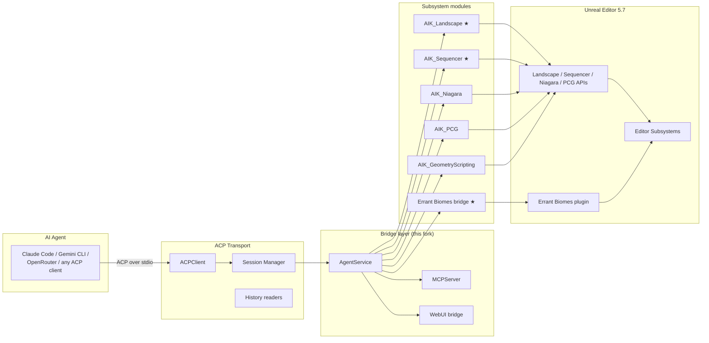

# Unreal Claude Agent Kit

> A custom fork of Betide Studio's *Agent Integration Kit* for Unreal Engine 5 — ported from 5.4 to 5.7, stripped to the modules I actually use, and extended with first-class tooling for cinematic landscape work on a real production project.

**Status:** in-progress port + extension. ACP transport compiles on 5.7. Custom landscape + sequencer modules are landing next.

**Browse:**
- → [`src/AIK_Landscape/`](./src/AIK_Landscape/) — reference implementation of one of the custom modules (real C++, not pseudo-code).
- → [`docs/tool-surface.md`](./docs/tool-surface.md) — full agent tool surface spec.
- → [`media/`](./media/) — demo GIFs and screenshots (drop zone).

---

## What it is

An in-editor bridge that lets an AI coding agent (Claude Code, Gemini CLI, OpenRouter, or any [ACP](https://github.com/agent-client-protocol)-compatible client) drive Unreal Engine 5 the way a developer would — placing actors, editing landscape, scattering meshes, painting biome masks, sequencing cinematics — through a typed tool surface rather than free-form clicks.

The upstream kit ([Betide Studio's Agent Integration Kit on Fab](https://www.fab.com/listings/b4f03b65-7d8b-47f3-aeab-a23284295242)) provides the ACP transport and ~25 subsystem modules. This fork:

- Targets **UE 5.7** instead of the upstream 5.4.
- Strips ~10 modules unused on this project (`Paper2D`, `nDisplay`, `LiveLink`, `MassAI`, `MetaHuman`, `ChaosOutfit`, etc.) to cut cold-build time.
- Removes upstream telemetry + crash reporter for a fully offline, private workflow.
- **Adds two custom modules** purpose-built for cinematic trailer work:
  - `AIK_Landscape` — region sculpt, heightmap paint, peak/normal/slope queries.
  - `AIK_Sequencer` — keyframe ops, camera shot management, master-sequence assembly.
- **Bridges [Errant Biomes](https://docs.errantphoton.com/biomes/painting_masks)** for name-addressed mask painting, value-mapping, and palette binding from an agent prompt.

## Architecture

★ = added, rewritten, or substantially modified in this fork. Upstream modules I don't use are not built or shipped.

---

## Engineering writeup

### Why fork instead of use the stock kit

The upstream Agent Integration Kit is generous but generic — it ships a tool surface for everything from `Paper2D` sprite editing to `nDisplay` cluster sync. A trailer-focused project doesn't need most of it. Three reasons the fork was worth the effort:

1. **Tool-surface fit.** A trailer pipeline lives or dies on landscape sculpting, scattering, sequencer, and biome painting. The stock kit either lacks these or wraps them too thinly for non-trivial ops (e.g., region sculpts in landscape grid coords vs. world cm — a silent footgun the stock kit doesn't catch). Custom modules with the actual workflow baked in beat a generic adapter.
2. **Build hygiene.** 25 modules → multi-minute cold builds and a ~600 MB intermediate directory. Stripping to the six modules I need cuts the iteration loop hard and makes "rebuild from clean" a routine action instead of a coffee break.
3. **Offline-only.** The upstream telemetry and crash reporter both call home. For a private commission project, that's a non-starter. Removed at the source level, not just disabled at runtime.

### The 5.4 → 5.7 port surface

Three real gotchas worth flagging for anyone porting any 5.4 plugin forward:

**MSVC 14.44 is banned.** UBT in 5.7 explicitly refuses MSVC `14.44.0`–`14.44.35210` due to compiler bugs that miscompile Unreal templates. It silently falls back to 14.38 with a warning buried in the build log. If 14.44 is the *only* MSVC toolchain on the machine, the build fails with no useful diagnostic. Fix: install `14.38.33130` via the Visual Studio installer's *Individual components* tab. Worth pinning in a project README.

**Live Coding owns module DLLs while the editor is open.** UBT refuses to build because it can't replace loaded DLLs. The error message suggests `Ctrl+Alt+F11` — but that's a Live Coding *patch* for already-loaded modules. **Adding a new module requires fully closing the editor**, period. Cost me one wasted iteration before I understood the distinction.

**Optional plugin references silently skip.** The upstream `.uplugin` lists 35 plugins as `Optional: true`. If a referenced plugin isn't installed on the target machine (e.g., `MetaHumanCharacter` on vanilla 5.7), the corresponding module quietly drops out of the build manifest instead of erroring. Portable, but you can't trust a green build status — every module needs to be verified-loaded post-build, not just verified-compiled.

### Architecture choices

- **ACP over stdio, not HTTP.** The upstream kit defaults to stdio transport instead of a TCP/HTTP server. Counterintuitive (everyone reaches for HTTP first), but it's the right call: no port conflicts, no firewall prompts, no auth layer to build. The agent process is just a child process of the editor. Trades cross-machine debugging for local simplicity, and on a single-developer machine that's the right trade.

- **Per-module isolation via `LoadingPhase: None`.** Every module except the core is `LoadingPhase: None`, meaning it's compiled but not auto-loaded. The core `AgentService` loads them on demand based on the agent's stated tool surface. Keeps editor boot fast and gives a clean dependency graph: a broken module never blocks editor startup.

- **Name-based mask binding for Errant Biomes.** The Errant Biomes plugin samples masks by *name string*, not by hard reference. The bridge module exposes `paint_mask(name, region, value)` as the primary tool — region is `{x1, y1, x2, y2}` in *landscape grid coords* (0..res), not world cm. Positional-array variants are explicitly rejected at the tool boundary; the stock kit's looser typing let positional args through and silently no-op'd, which is the kind of bug that wastes an afternoon if you don't know to look for it.

### Toolchain

| | |
|---|---|
| Engine | UE 5.7.0 |
| Compiler | MSVC 14.38.33130 (UBT-enforced; 14.44 banned) |
| Transport | Agent Client Protocol (ACP) over stdio |
| Agents tested | Claude Code, Gemini CLI, OpenRouter |
| Build | UnrealBuildTool, adaptive non-unity (`git status`-driven) |
| Project context | Cinematic trailer, single developer, Windows host |

---

## What's in this repository

This is a **writeup of the engineering work**, not a republish of source. The base ACP transport layer is proprietary to Betide Studio and is not redistributed here.

You'll find:
- This README and architecture documentation.
- Module specs and design notes for `AIK_Landscape`, `AIK_Sequencer`, and the Errant Biomes bridge — the modules I authored.
- Port notes from UE 5.4 → 5.7.

You won't find:
- The base Agent Integration Kit source code. To evaluate the original kit, see [Betide Studio's listing on Fab](https://www.fab.com/listings/b4f03b65-7d8b-47f3-aeab-a23284295242).
- Project assets from the trailer this kit was built for (private repo).

---

## License

This writeup is MIT-licensed. Linked upstream products (Agent Integration Kit, Errant Biomes, Unreal Engine) are governed by their own licenses.

## Author

Lina Hal Hasnawi · [github.com/linahalhasnawi-boop](https://github.com/linahalhasnawi-boop)
